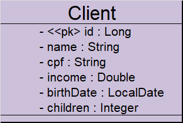

[//]: # (Start of README.md)

# Projeto CRUD de Clientes

Este é um projeto Spring Boot que implementa um CRUD completo de web services REST para acessar recursos de clientes. O projeto foi desenvolvido em Java, utiliza o banco de dados H2 para ambiente de testes e possui o Maven como gerenciador de dependências.



## Funcionalidades

- Busca paginada de recursos de clientes
- Busca de recurso de cliente por ID
- Inserção de novo recurso de cliente
- Atualização de recurso de cliente
- Deleção de recurso de cliente

## Configuração e Execução

### Pré-requisitos

- Java Development Kit (JDK) 11 ou superior
- Maven

### Passos para executar o projeto

Clone o repositório do projeto:

   ```bash
    git clone git@github.com:ThiagoDRangel/CRUD-JAVA.git
   ```
  </br>

### Como utilizar o projeto </br>

- Busca de cliente por id
  ```bash
    GET /clients/1
  ```

- Busca paginada de clientes
    ```bash
    GET /clients?page=0&size=6&sort=name
    ```

- Inserindo novos clientes
    ```bash
    POST /clients
    {
    "name": "Maria Silva",
    "cpf": "12345678901",
    "income": 6500.0,
    "birthDate": "1994-07-20",
    "children": 2
    }
    ```

- Atualizando um cliente existente
    ```bash
    PUT /clients/1
    {
    "name": "Maria Silvaaa",
    "cpf": "12345678901",
    "income": 6500.0,
    "birthDate": "1994-07-20",
    "children": 2
    }
    ```

- Deletando dados de um cliente
    ```bash
    DELETE /clients/1
    ```

# CHECKLIST

## O projeto atende aos seguintes requisitos: </br> </br>

1. > A busca por ID retorna o cliente existente. 

2. > A busca por ID retorna o código de resposta 404 para cliente inexistente.
3. > A busca paginada retorna corretamente a listagem paginada de clientes.
4. >  A inserção de um novo cliente insere corretamente o cliente com dados válidos.
5. > A inserção de um novo cliente retorna o código de resposta 422 e mensagens customizadas para dados inválidos.
6. > A atualização de um cliente atualiza corretamente o cliente com dados válidos.
7. > A atualização de um cliente retorna o código de resposta 404 para cliente inexistente.
8. > A atualização de um cliente retorna o código de resposta 422 e mensagens customizadas para dados inválidos.
9. > A deleção de um cliente deleta corretamente o cliente existente.
10. > A deleção cliente retorna 404 para o cliente inexistente.